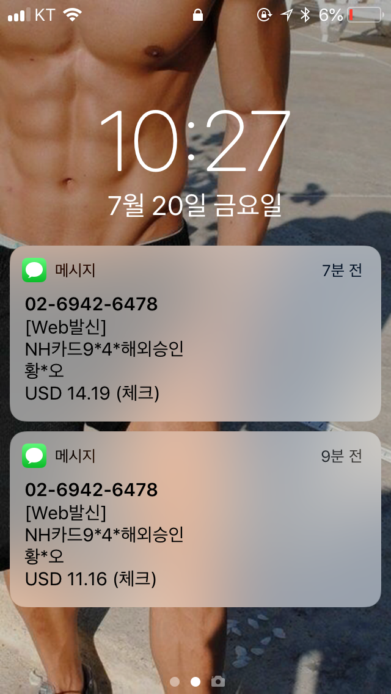
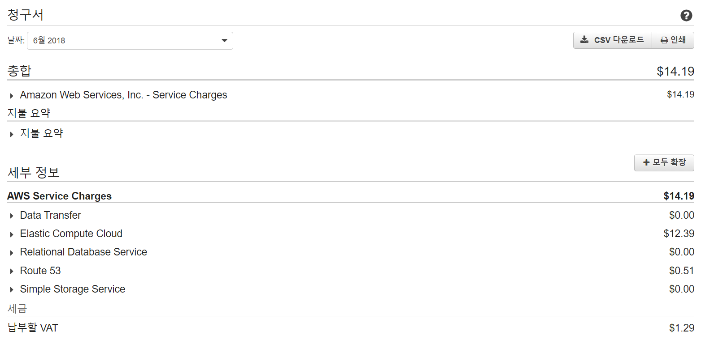
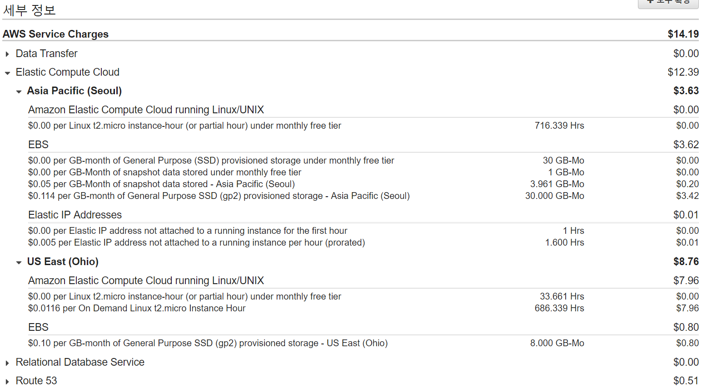

AWS 과금 ㅠㅠㅠㅠㅠㅠㅠㅠㅠㅠㅠㅠㅠㅠ

## R.I.P

치킨이 하늘나라로...

(사실, 50$ 크레딧 쿠폰 있는데, 쓸 줄을 몰라서 결제했다ㅠ. 결제하고 쿠폰등록하니 7월꺼는 자동으로 크레딧에서 나가짐)

---

과금먹으면 서비스들이 중지된다.

센텀에서 배운 Jmeter 써먹으려고 블로그 들어갔는데 안되서 AWS 재부팅하려했는데.... 아아악.........

이미 지불해버려서 사진이 없네..

5, 6월 과금이 되었는데..

**서비스 - 결제 - 청구서 - 6월 2018**

**세부정보** 를 누르면 왜 과금을 먹었나.. 볼 수 있다.

오하이오에 인스턴스가 생성되어 있었다.

실수로 만들어놨었나보다.

ec2는 한달 750시간 무료인데, 인스턴스 2개 실행 했으니

24 x 30 x 2 = 1440시간 켜놨다ㅠㅠ

&nbsp;
&nbsp;

### 의문점

**1. 오하이오 / 서울 동시에 켜놨는데 과금은 오하이오에서만 먹었다.**

반반씩 나와야 하는거 아닌가?

&nbsp;

**2. 프리티어 ec2 인스턴스 만들면 30GB까지 무료로 알고 있었는데, 아닌가?**

지금 인스턴스 서울: 2개 (EBS: 30Gb + 30Gb), 오하이오: 1개 (8Gb) 인데,

딱 그만큼 과금먹었다. 서울 30GB, 오하이오 8GB

EBS는 서울이 더 비싸네

---

안쓰는 인스턴스 그냥 지워야겠다.

인스턴스 가동 안해도 EBS가 갖고있는 공간은 과금이 되구나.. 아닌가? 아모르겠따
