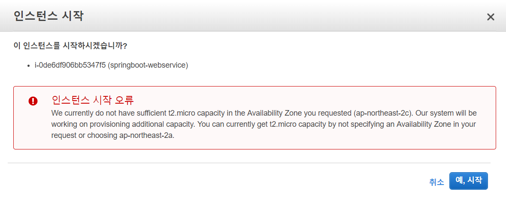

EC2 사용하고 있던 인스턴스를 **중지** 시키고 **실행** 시켰는데

위에 사진처럼 떠버렸습니다.

가용영역을 변경하라는거같은데..

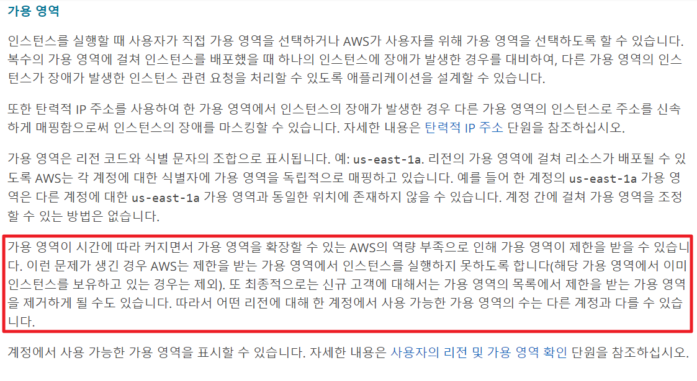

가용영역에 빈자리가 없나봐요.

자동으로 비어있는 가용영역으로 찾아갈 줄 알았는데 아니네요.

### AMI 생성

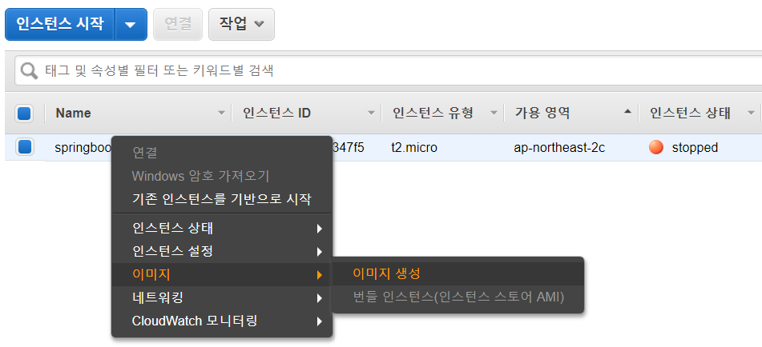

&nbsp;

### 인스턴스 생성

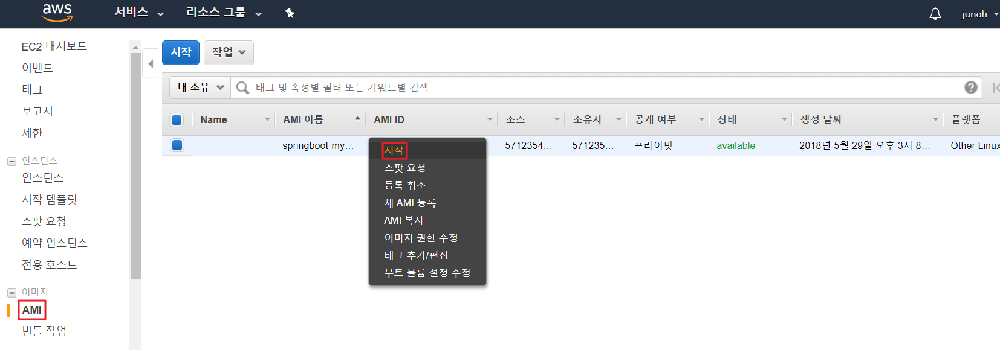

`시작` 을 누르면 다시 인스턴스를 생성합니다.

보안그룹은 기존꺼 가져다 썼습니다.

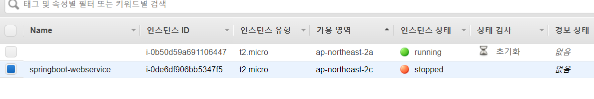

&nbsp;

### 새 인스턴스에 Elastic IP 할당

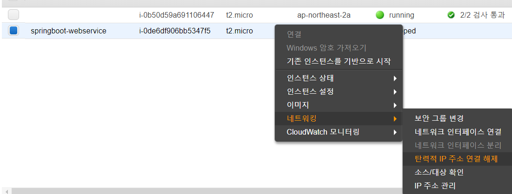

&nbsp;

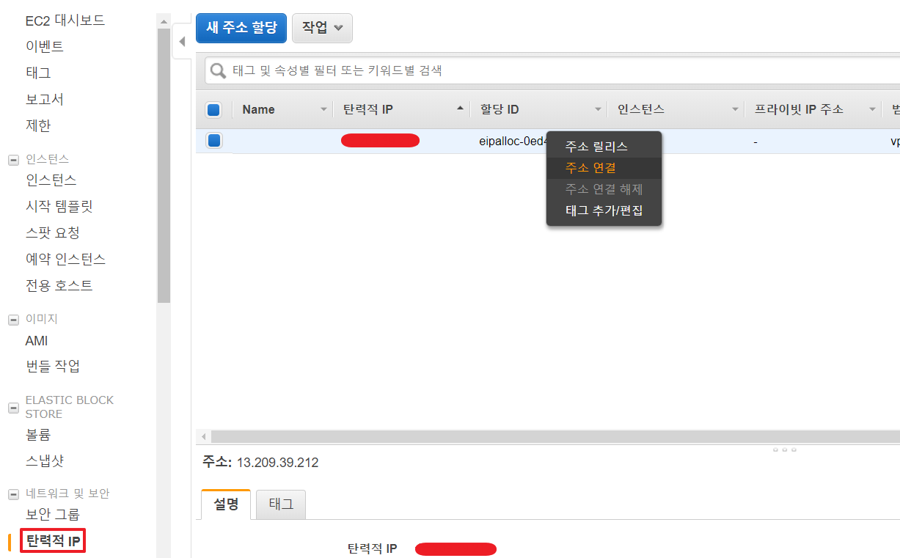

&nbsp;

### SSH 접속

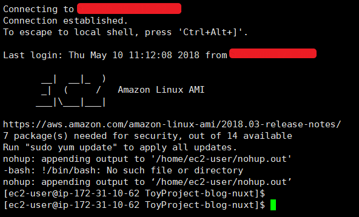

휴 성공!

근데 저는 SSH를 root권한으로 이용했었는데,

이 설정은 다시 해줘야 하네요.

&nbsp;

### 끝이 아니다!

**1. IAM 설정**

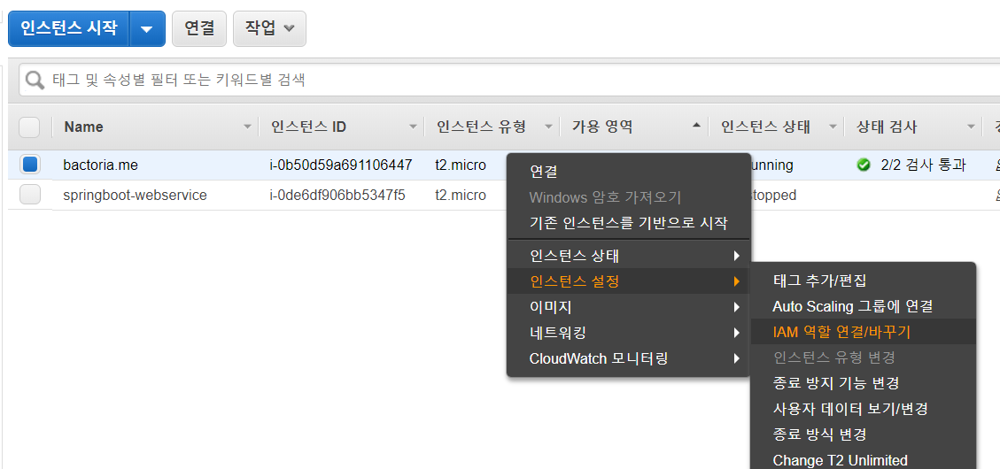

&nbsp;

**2. CodeDeploy 인스턴스 변경**

CodeDeploy 를 이용하여 배포하고 있다면,

인스턴스를 바꿔줘야겠죠 ?

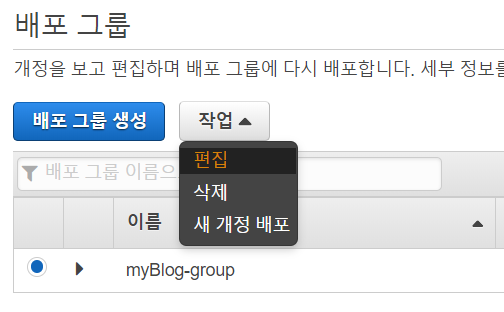

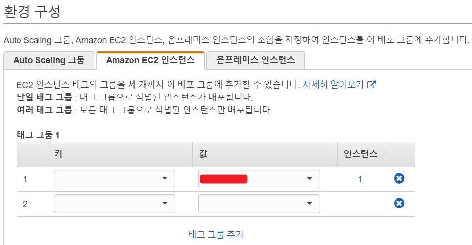

&nbsp;
&nbsp;

### 기존 인스턴스 제거 ?

stopped된 것은 과금되지 않으니까. 저는 일단 놔뒀습니다.
