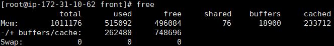
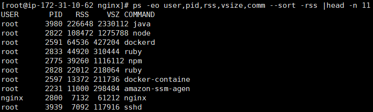
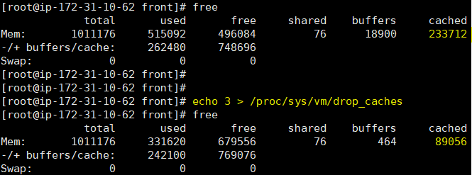
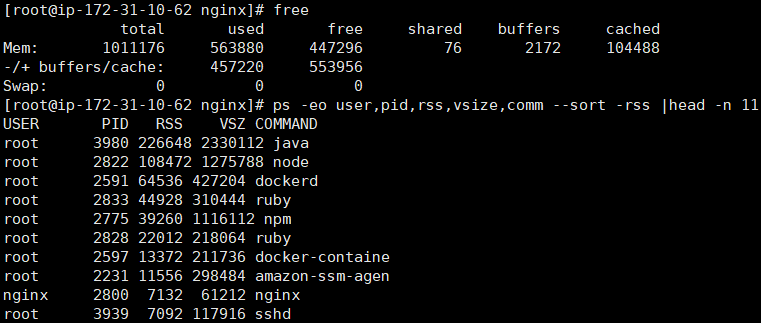

## memory

&nbsp;
&nbsp;

### 메모리확인

**free**

&nbsp;

(프로세스별 점유 메모리)

**ps -eo user,pid,rss,vsize,comm --sort -rss |head -n 11**

RSS (Resident Set Size) : 실제 메모리
VSZ : 가상 메모리

&nbsp;

### 캐시 제거

**echo 3 > /proc/sys/vm/drop_caches**

(options)

`echo 1 > /proc/sys/vm/drop_caches`  
: pagecache 비우기

`echo 2 > /proc/sys/vm/drop_caches`  
: dentries, inodes 비우기

`echo 3 > /proc/sys/vm/drop_caches`  
: pagecache, dentries, inodes 비우기

&nbsp;
&nbsp;

( Cache 제거 후 프로세스 메모리 확인해보면 똑같음..)

