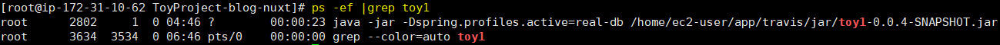
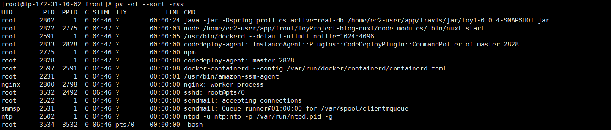
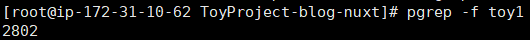
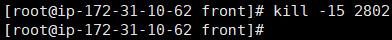

## ps

### 실행중인 프로세스 정보 확인

**ps -ef |grep "프로세스 이름"**



&nbsp;

(메모리 많이 점유하는 순으로 sort)

**ps -ef --sort -rss**



메모리가 모자랄 때 간단히 체크 가능

&nbsp;

### 실행중인 프로세스 PID 확인

**pgrep -f "프로세스 이름"**



&nbsp;

(쉘스크립트 작성 시 유용)

**~.sh**
```bash
CUR_PID=$(pgrep -f ToyProject)

if[ -z $CUR_PID];then
  echo "> 실행중인 프로세스가 없습니다."
else
  echo "> 실행중인 프로세스 종료"
fi
```

&nbsp;

### 프로세스 종료

**kill -15 'PID'**



&nbsp;
&nbsp;
