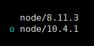

`apt-get install npm` 을 이용하여 npm 설치했는데

낮은 버전이 다운로드 되었다.

그래서 `npm install`이 안되는 상황..

&nbsp;

```bash
npm install -g n

n --lastest
# 최신 버전 확인

n --stable
# stable 버전 확인

n --lts
# LTS 버전 확인

n 8.11.3
# 버전 설치 ex) 8.11.3

n lastest
# 최신 버전 설치

n stable
# stable 버전 설치

n lts
#LTS 버전 설치
```

&nbsp;
&nbsp;

**버전 왔다갔다하기**

```bash
n 8.11.3
# 8.11.3 버전 설치

n 10.4.1
# 10.4.1 버전 설치

n
#버전 변경
```


