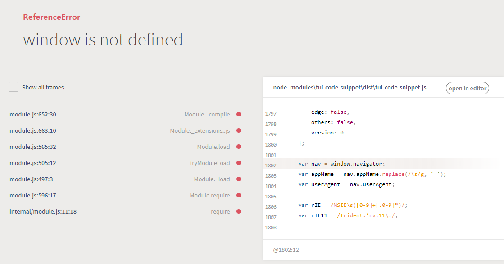
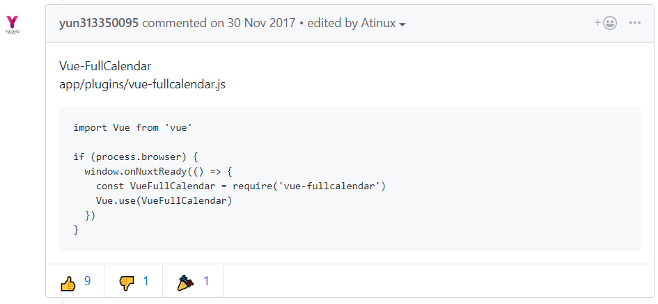
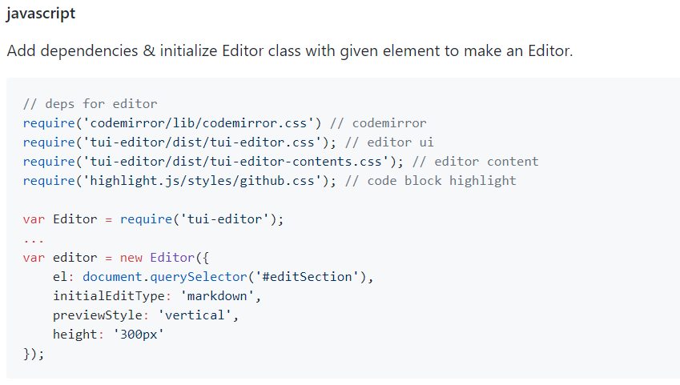
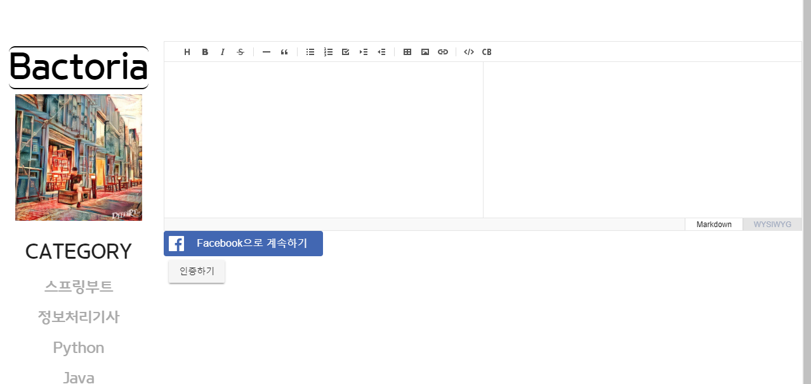

### 1. window is not defined



&nbsp;

#### solutions

SSR에서 발생하는 문제. Vue.js를 이용하면 안나타나겠지..? ㅠ

https://nuxtjs.org/faq/window-document-undefined



뭐 이렇다는데..

일단 문제는 이거였음



걍 <script> 에 복붙하니까 위의 에러가 난거였음.

이걸 nuxt.js에 어떻게 적용시켜야하나

```javascript
<template>

  <div id="editSection"></div>

</template>


<script>

  if (process.browser) {
    var Editor = require('tui-editor');
  }

  export default {
    mounted: () => {
      var editor = new Editor({
        el: document.querySelector('#editSection'),
        initialEditType: 'markdown',
        previewStyle: 'vertical',
        height: '300px'
    })
  }
}

</script>


<style lang="scss" scoped>


</style>

```

사실, issue에서는 `vue.use()` 를 썼었는데 내경우에는 저걸 쓰니까 아무것도 안떴음.



위 코드로 하면 나옴.


&nbsp;
&nbsp;

### 2.
