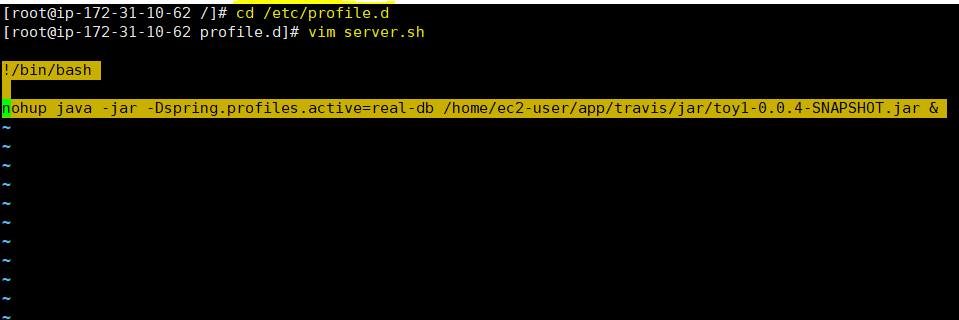

# 리눅스 - 시작프로그램

리눅스 시작 할 때 자동 실행시키는 법

내가 쓰는 법

### /etc/profile.d/

- 스크립트 파일을 넣어두면 된다.

- chmod 755

&nbsp;

example) **server.sh**

### 다른 방법들

1. vi /etc/rc.local
2. vi /etc/rc.local
3. /usr/share/autostart/
