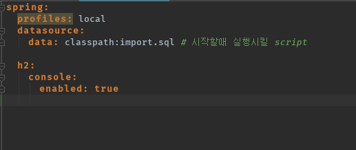
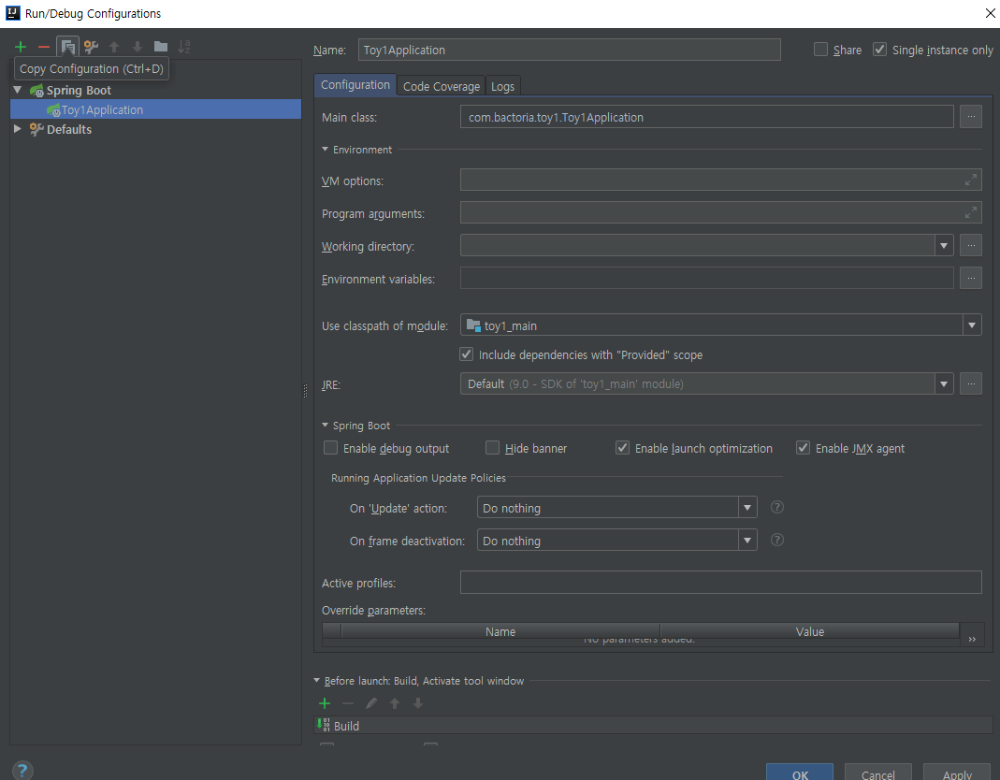
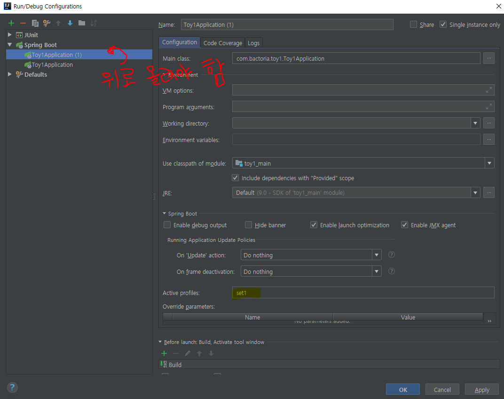
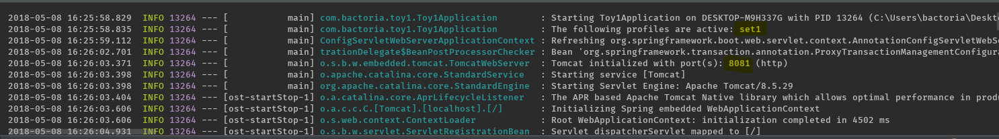
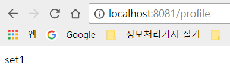

spring boot 의 configuration 을 위해 **application.properties** 또는 **application.yml** 을 사용한다.

허나, 외부에 공개되어서는 안될 정보가 있을 수 있다.

**application.yml**



여기에 무중단배포할 때 사용하는 운영환경의 설정 (Database 접속정보, 세션저장소 접속정보, 암호화 키 등등)Set1, Set2 이런거.. 여기다가 추가하면 안됨

왜냐??

우린 GitHub 에 소스 공개할껀데

모든 사람이 내 운영환경 정보를 알 수 있음

이걸 악용해서 AWS 과금먹일 수가 있음

한번이라도 커밋 되면 이력이 남기 때문에 프로젝트 삭제해야함

안되!!!

그럼 별도의 파일은 내컴퓨터에 있으며,

스프링부트가 내 로컬에 위치한 configuration 파일을 추가적으로 읽어들이도록 해야함.

&nbsp;

### real-applcation.yml 생성

```yml
---
spring:
  profiles: set1
server:
  port: 8081

---
spring:
  profiles: set2

server:
  port: 8082
```

로컬 용임.

위는 profiles가

set1일때 포트를 8081로 설정..

set2일때 포트를 8082로 설정..

&nbsp;
&nbsp;

### Application.java 수정

real-application.yml 파일을 읽어들이도록 해야 함.

**기존**

```java
@EnableJpaAuditing //JPA Auditing 활성화
@SpringBootApplication
public class Toy1Application {

    public static void main(String[] args) {
        SpringApplication.run(Toy1Application.class, args);
    }
}
```

<br/>

**변경 후**

```java
public class Toy1Application {

    public static final String APPLICATION_LOCATIONS = "spring.config.location="
            + "classpath:application.yml," // application.yml 에 붙이겠다
            + "C:/Users/bactoria/real-application.yml"; // 이 파일을

    public static void main(String[] args) {

        //빌더패턴
        new SpringApplicationBuilder(Toy1Application.class)
            .properties(APPLICATION_LOCATIONS)
            .run(args);
    }
}
```

&nbsp;

### profile 확인할 수 있는 컨트롤러 추가

**WebRestController.java**

```java
//...
@GetMapping("/profile")
    public String getProfile () {
        return Arrays.stream(env.getActiveProfiles())
                .findFirst()
                .orElse("Not Exist");
    }
```


<BR/>


### Profiles 을 설정하여 스프링부트 실행시키기

`Ctrl + Shift + A`

`Edit Configurations`






**실행!!!**





It work!!

굿..

&nbsp;
&nbsp;

## DB

PostgreSQL

gradle dependency 추가

`compile('org.postgresql:postgresql:42.2.2.jre7')`


**real-application.yml 일부**
```yml

#... 생략

spring:
  jpa:
    database: POSTGRESQL
    show-sql: true
    hibernate:
      ddl-auto: create-drop
  datasource:
    platform: postgres
    url: jdbc:postgresql://localhost:5432/myDB  
        #jdbc:postgresql://ip:port/DB
    username: foo
    password: bar
    driverClassName: org.postgresql.Driver
```

걍 따라서..

다음번에할때는 새로또 만들어서 다시 해보자

자세한설명 생랴아악!

&nbsp;
&nbsp;

### 참고자료

[스프링부트로 웹 서비스 출시하기 - 8. 운영 환경 설정 - jojoldu 님 블로그](http://jojoldu.tistory.com/269?category=635883)

[Database application.yml for Spring boot from applications.properties - StackOverFlow](https://stackoverflow.com/questions/33323837/database-application-yml-for-spring-boot-from-applications-properties?utm_medium=organic&utm_source=google_rich_qa&utm_campaign=google_rich_qa)
